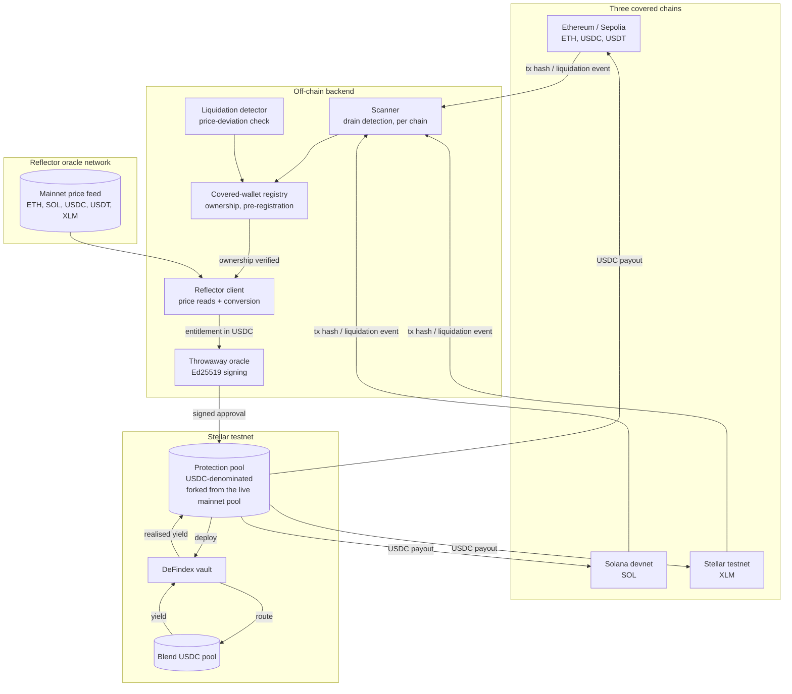
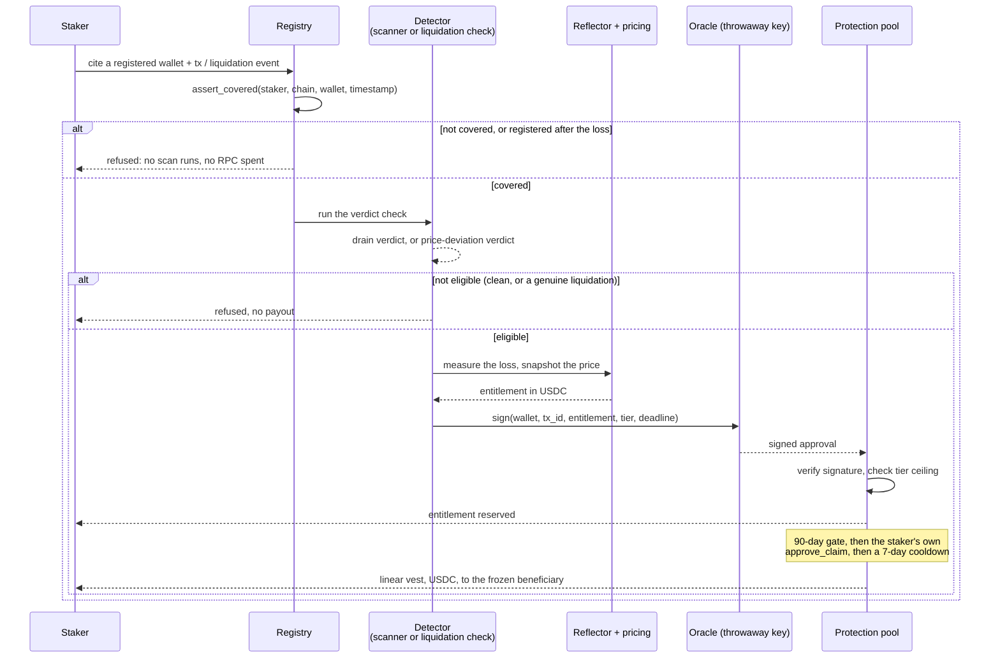
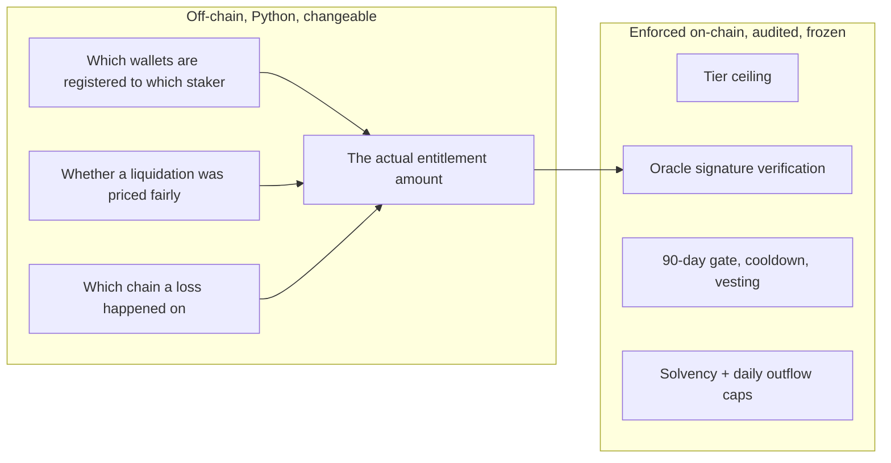

# Architecture

## System



## Claim sequence: either attack type, one signer



Both attack types: a wallet drain and a wrongful liquidation, produce the same shape of signed approval and go through the same contract path from here. The detector differs; nothing downstream of it does.

## Trust boundary



The contract never learns what was lost, on which chain, or why a liquidation was ruled wrongful. It verifies one signed number against a ceiling it can never exceed. Everything that decides that number lives off-chain and can be corrected without touching the audited artifact, the same on-chain/off-chain split SAFU's mainnet pool already runs on.

## Backend layout

```
backend/
  assets.py            hackathon-local asset allowlist (read-only copy of production's tables)
  chains.py             testnet chain-ID registration (additive, never overwrites)
  registry.py           covered-wallet pre-registration: the ownership fix
  incident.py            same-incident coherence check (bundling, not fraud detection)
  loss.py                 exact loss-amount derivation per chain
  prices.py               Reflector client + integer loss-to-USDC conversion
  liquidation.py           wrongful-liquidation price-deviation detector
  claim.py                 drain-claim orchestrator
  liquidation_claim.py     wrongful-liquidation-claim orchestrator (same registry, same gate)
  oracle.py                throwaway keypair, payload construction, signing
  submit.py                ties any claim context to a signed, ready-to-submit call
```

Every module above is independently unit-tested against injected dependencies (a fake scanner, a fake price client), none of it needs a network to test, and none of it was tested against a mock standing in for the real logic.

## What's forked, and what never changes

The `protection-pool` contract here is a copy, `cp -R`, never an edit, of the live, audited Soroban pool. The original stays at its audit-frozen WASM hash; nothing in this repository ever writes to it. This fork adds one thing the original didn't have: a yield-split mechanism (a growing index for the staker's share, an explicit counter for the protocol's), built and reviewed the same way the rest of the pool was, Rust unit tests covering both the new accounting and its interaction with every existing invariant.
